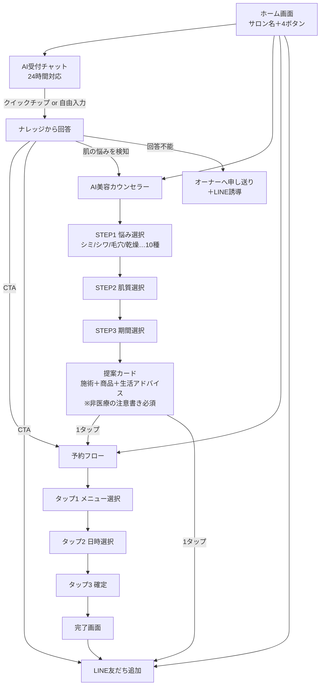
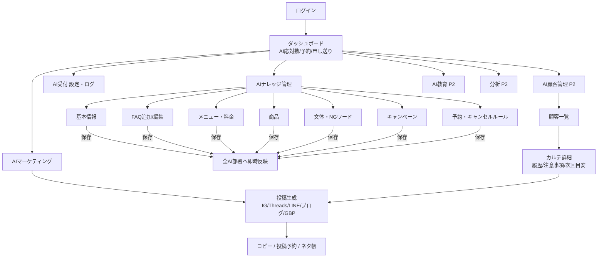
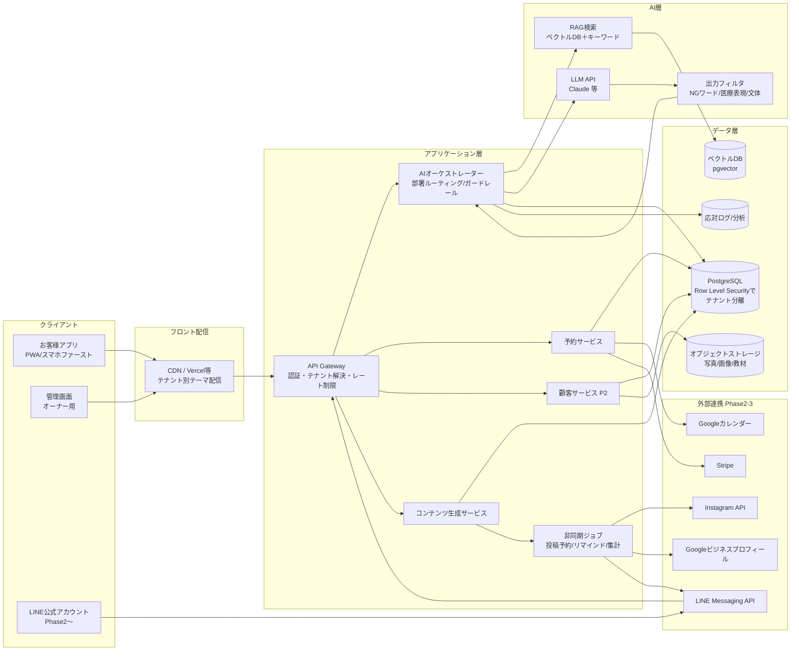
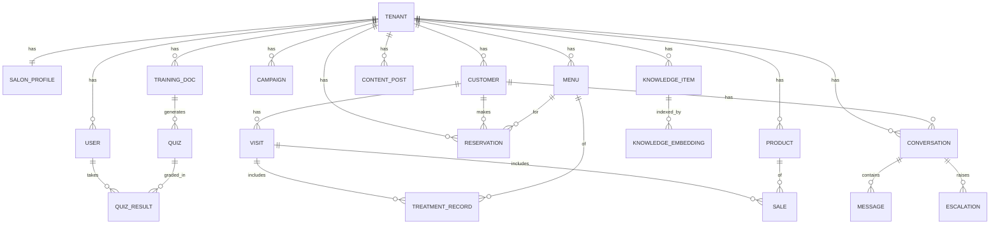
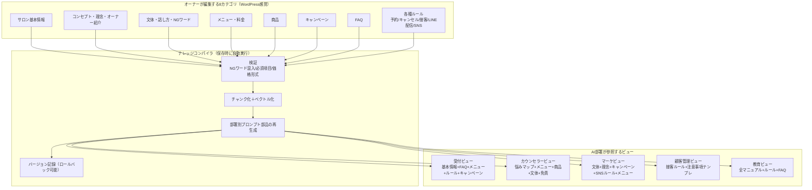

# Salon AI OS — 設計ドキュメント

> 「AIスタッフが24時間働くサロン」を実現するプラットフォームの全体設計。
> ホームページ制作ではなく、**AI受付・AIカウンセラー・AIマーケ・AI顧客管理・AI教育の5部署がナレッジを共有して働くOS** を設計する。

---

## 目次

1. [プロダクト原則](#1-プロダクト原則)
2. [画面遷移図](#2-画面遷移図)
3. [システム構成図](#3-システム構成図)
4. [データベース設計](#4-データベース設計)
5. [AIナレッジ構造](#5-aiナレッジ構造)
6. [SaaS化を見据えたアーキテクチャ](#6-saas化を見据えたアーキテクチャ)
7. [テンプレート販売を前提とした設計思想](#7-テンプレート販売を前提とした設計思想)
8. [開発ロードマップと今後追加すべき機能](#8-開発ロードマップと今後追加すべき機能)
9. [安全性・法務ガードレール](#9-安全性法務ガードレール)

---

## 1. プロダクト原則

| # | 原則 | 実装への落とし込み |
|---|------|------|
| 1 | **AIはチャットボットではなく「部署」** | 各AIは役割・口調・参照ナレッジ・KPIを持つ。受付は応対数と予約転換、マーケは投稿数と反応、と部署ごとに成果が見える |
| 2 | **Single Source of Truth = ナレッジ** | AIは毎回ゼロから考えない。全部署が同一のナレッジベースを参照し、1箇所更新すれば全AIに即時反映 |
| 3 | **40〜60代オーナーが迷わない** | 3タップ以内・専門用語ゼロ・「保存してAIに反映」のような結果がわかるボタン文言・入力は択一が基本 |
| 4 | **答えられない質問は資産** | AIが回答できなかった質問は自動でオーナーに申し送り→ワンタップでFAQ化。使うほど賢くなるループ |
| 5 | **医療リスクの構造的排除** | カウンセラーの回答はテンプレート＋ナレッジ合成で生成し、NGワード（治る・効く等）をシステム側で強制フィルタ |
| 6 | **MVPファースト** | Phase 1はDB最小構成＋静的配信でも成立する設計。Phase 2以降の機能はUI上に「PHASE 2」バッジで予告し、期待値を管理 |

---

## 2. 画面遷移図

### 2-1. お客様側（3タップ設計）



### 2-2. 管理画面（オーナー側）



**遷移の設計ルール**

- お客様側は「ホーム → 目的 → CTA」の最大2階層。どの画面からも予約とLINEに1タップで到達できる
- 管理画面の全編集フォームは「保存してAIに反映」で完結。保存＝反映であり、別途「公開」操作を作らない
- 回答不能→申し送り→FAQ化→回答可能、のループがダッシュボードから1タップで回る

---

## 3. システム構成図



**AIオーケストレーターの応答パイプライン（全部署共通）**

```
ユーザー入力
  → ① テナント解決（どのサロンか）
  → ② 部署ルーティング（受付/カウンセラー/マーケ…）
  → ③ ナレッジ検索（RAG：FAQ・メニュー・ポリシー・文体）
  → ④ プロンプト合成（部署の役割定義＋検索結果＋文体ルール）
  → ⑤ LLM生成
  → ⑥ ガードレール（NGワード置換・医療表現ブロック・免責文の自動付与）
  → ⑦ 回答＋CTA（予約/LINE）
  → ⑧ ログ保存（回答不能なら申し送りキューへ）
```

Phase 1 は ③ をキーワードマッチ、⑤ をテンプレート合成で代替可能（プロトタイプはこの方式で動作）。同じパイプライン形状のまま Phase 2 で LLM+RAG に差し替える。

---

## 4. データベース設計

マルチテナントSaaSを前提に、**全テーブルが `tenant_id` を持ち、PostgreSQLのRow Level Securityで分離**する。



### 主要テーブル定義

```sql
-- テナント（=契約サロン）
tenant(id, plan, status, custom_domain, theme_id, created_at)

-- ユーザー（オーナー/スタッフ。権限はPhase3で拡張）
user(id, tenant_id, role, name, email, line_user_id)

-- サロンプロフィール（ナレッジの「基本情報」実体）
salon_profile(tenant_id, name, catch, concept, owner_intro,
              hours, closed, address, parking, tel, line_url,
              tone_style, ng_words[], persona_notes)

-- 汎用ナレッジ（FAQ/接客ルール/理念など種類をtypeで持つ）
knowledge_item(id, tenant_id, type, -- faq / policy / concept / rule / sns_rule
               title, body, keywords[], status, updated_at)
knowledge_embedding(id, knowledge_item_id, chunk, vector)  -- pgvector

-- メニュー・商品・キャンペーン
menu(id, tenant_id, name, price, duration_min, description,
     target_concerns[], member_only, sort)
product(id, tenant_id, name, price, description, target_concerns[], stock_note)
campaign(id, tenant_id, title, body, starts_on, ends_on, status)

-- 顧客・カルテ（Phase 2）
customer(id, tenant_id, name, kana, tel, line_user_id,
         membership, caution_notes, next_visit_hint, created_at)
visit(id, tenant_id, customer_id, visited_on, staff_note)
treatment_record(id, visit_id, menu_id, memo, photo_keys[])
sale(id, visit_id, product_id, quantity, amount)

-- 会話（全AI部署共通）
conversation(id, tenant_id, customer_id NULL, department, -- reception/counselor
             channel, -- web/line
             started_at)
message(id, conversation_id, role, -- user/ai
        body, matched_knowledge_ids[], created_at)
escalation(id, conversation_id, question, status, -- open/answered/dismissed
           resolved_knowledge_id NULL)  -- FAQ化されたら紐付け＝学習ループ

-- 予約（Phase1は「予約リクエスト」、Phase3で確定枠管理へ拡張)
reservation(id, tenant_id, customer_id NULL, menu_id,
            requested_at, status, -- requested/confirmed/cancelled
            source) -- ai_chat/counselor/line/direct

-- マーケティング
content_post(id, tenant_id, platform, topic, body, hashtags[],
             status, -- draft/scheduled/posted
             scheduled_at, metrics_json)

-- 教育（Phase 2）
training_doc(id, tenant_id, category, title, body, video_url NULL)
quiz(id, tenant_id, training_doc_id, question, options[], answer_idx)
quiz_result(id, quiz_id, user_id, correct, answered_at)
```

**設計上のポイント**

- `escalation.resolved_knowledge_id` — 「答えられなかった質問→FAQ化」の学習ループをスキーマで表現
- `menu.target_concerns[]` / `product.target_concerns[]` — カウンセラーの「悩み→提案」マッピングをデータ駆動にし、サロンごとにカスタマイズ可能
- `message.matched_knowledge_ids[]` — どのナレッジが回答に使われたかを記録し、「参照されていないナレッジ」「よく使われるFAQ」を分析可能
- `reservation.source` — AI経由の予約転換率（このプロダクトの最重要KPI）を計測

---

## 5. AIナレッジ構造

ナレッジは「オーナーが編集する単位」と「AIが参照する単位」を分けて設計する。



**核となる考え方**

1. **1回の保存で全部署に反映** — 編集カテゴリと部署ビューはM:Nの関係。例：キャンペーンを1件追加すると、受付の案内文・カウンセラーの提案・マーケの投稿生成の3箇所が同時に変わる（プロトタイプで体験可能）
2. **文体・NGワードは「横断ナレッジ」** — すべての部署ビューに必ず注入される。サロンの「らしさ」と安全性を担保する層
3. **ナレッジは資産** — 応対ログから「よく聞かれる質問」「答えられなかった質問」を検出し、ナレッジ追加を提案。運用するほどそのサロン専用AIに育つ
4. **バージョン管理** — 保存ごとにスナップショットを取り、「昨日の状態に戻す」をワンタップで提供（間違い入力への安心感＝非IT層向けの必須機能）

---

## 6. SaaS化を見据えたアーキテクチャ

### 6-1. マルチテナント戦略

| 層 | 方式 | 理由 |
|----|------|------|
| DB | 共有DB＋Row Level Security | 個人サロン規模（数千テナント）ではコスト効率が最良。エンタープライズ（多店舗チェーン）はPhase3でスキーマ分離を追加 |
| アプリ | 完全共有（single codebase） | テナント差分はすべて「ナレッジ＋テーマ設定」データで表現し、コード分岐を作らない |
| フロント | `{tenant}.salon-ai-os.jp` ＋独自ドメイン接続 | テンプレ販売時は独自ドメインが必須要件 |
| AI | 共有LLM＋テナント別ナレッジ注入 | テナント別ファインチューニングはしない。RAGで十分に「そのサロンらしさ」が出る設計 |

### 6-2. 収益モデルとプラン設計

```
フリー     ¥0        AI受付のみ / 月50応対 / OSブランド表示
スタンダード ¥9,800/月  Phase1全機能 + LINE連携 / 応対無制限
プロ       ¥29,800/月 Phase2全機能（カルテ・SNS・分析）+ 独自ドメイン
テンプレート買切り ¥98,000〜  制作代行パートナー経由の初期構築 + 月額へ接続
ライセンス   個別契約    代理店・美容ディーラー向けOEM（ホワイトラベル）
```

- **従量コスト管理**: LLM呼び出しはテナント別に計測し、プラン上限とアラートを持つ（`usage_log`テーブル）
- **アップグレード導線**: Phase2機能はUI上に常時見えている（グレーアウト＋バッジ）。「使いたくなったら1タップで解放」

### 6-3. スケールの段階

```
Stage 0（プロトタイプ）: 静的HTML＋localStorage        ← 今ここ
Stage 1（MVP・〜10店）  : Next.js＋Supabase(RLS)＋Claude API。1リージョン
Stage 2（〜300店）      : ジョブキュー分離 / 応対ログ分析基盤 / LINE・IG連携
Stage 3（〜数千店）     : 読み取りレプリカ / ベクトル検索専用化 / OEMマルチブランド
```

---

## 7. テンプレート販売を前提とした設計思想

**「コードを売る」のではなく「設定一式（=サロンの人格）を売る」**。

1. **テーマとナレッジの完全分離**
   - 見た目（色・フォント・角丸・写真枠）は `theme.json`、中身（文言・メニュー・FAQ）は ナレッジDB。テンプレート＝この2つの初期値セット
2. **業種テンプレート**
   - エステ / 美容室 / ネイル / アイラッシュ / 整体 / リラクゼーションの6業種分の「悩みマップ・メニュー雛形・FAQ雛形・投稿雛形」を同梱。導入時に業種を選ぶと、その業種の初期ナレッジが展開される
   - 業種差分はすべてデータ（`industry_template`テーブル）。コードは1本
3. **セットアップウィザード（導入30分）**
   - 業種選択 → 基本情報入力 → メニュー3件登録 → 文体を3択から選ぶ → 完了。この5ステップで「AIスタッフが働き始める」体験を作る
4. **制作パートナー向け機能**
   - テンプレートの複製・卸価格・パートナーダッシュボード（Phase3）。代理店が自分の顧客サロンを一覧管理できる
5. **エクスポート可能性**
   - ナレッジはJSONで書き出し/取り込み可能にし、「データはサロンのもの」を保証。解約障壁で縛らないことが個人サロン市場での信頼になる

---

## 8. 開発ロードマップと今後追加すべき機能

### Phase 1 — MVP（本プロトタイプの範囲）
- [x] AI受付（FAQ・営業案内・24時間）
- [x] AI美容カウンセラー（10悩み × 3ステップ → 提案 → 予約/LINE導線）
- [x] 予約リクエスト（3タップ）
- [x] LINE導線（友だち追加CTA）
- [x] 管理画面（ナレッジ8カテゴリ・FAQ即時反映・投稿生成）
- [x] 申し送り（回答不能→FAQ化ループ）

### Phase 2 — 定着
- [ ] 電子カルテ（来店・施術・販売履歴、写真保存）
- [ ] LINE Messaging API連携（AI受付をLINE上で稼働）
- [ ] 投稿カレンダー・予約投稿・人気投稿分析（Instagram API）
- [ ] 分析ダッシュボード（AI応対→予約転換率、削減時間の可視化）
- [ ] 教育コンテンツ自動生成（ナレッジ→マニュアル→理解度テスト）
- [ ] ナレッジのバージョン管理・ロールバック

### Phase 3 — プラットフォーム
- [ ] 予約枠のリアルタイム管理・Googleカレンダー同期
- [ ] Stripe決済・回数券・サブスク会員
- [ ] EC（ホームケア商品の通販）
- [ ] AI音声受付（電話応対）・音声入力カルテ
- [ ] 多店舗管理・スタッフ権限
- [ ] パートナー/OEMダッシュボード

### 追加提案（要望リスト外だが価値が高いもの）
- **リマインド＆フォローAI**: 来店周期が空いた顧客を検知し、その顧客の履歴を踏まえたLINE文面を下書き（プロトタイプのカルテ画面でデモ済み）
- **口コミ返信AI**: Googleビジネスプロフィールの口コミへ、文体ナレッジで返信案を生成
- **ノーショー対策**: 前日リマインド＋当日キャンセルポリシーの自動案内
- **導入診断LP**: 「あなたのサロンの月間削減時間」を試算するリード獲得ツール

---

## 9. 安全性・法務ガードレール

| リスク | 対策 |
|------|------|
| 医療広告・薬機法抵触 | NGワード辞書（治る/効く/改善を保証 等）を出力フィルタで強制。カウンセラー回答に免責文を自動付与。「症状が続く場合は皮膚科へ」の誘導をテンプレートに組み込み |
| 個人情報（カルテ・写真） | テナント分離（RLS）＋写真は署名付きURL。ナレッジエクスポートに顧客データは含めない |
| AIの誤案内 | 価格・営業時間などの事実情報はLLMに生成させず、ナレッジDBの値をそのまま埋め込む（ハルシネーション構造的防止） |
| なりすまし・逸脱 | AIである旨を初回メッセージで明示。範囲外の質問は申し送り＋LINE誘導に固定 |

---

*本ドキュメントは `salon-ai-os/prototype.html`（クリック可能プロトタイプ）と対で管理する。*
